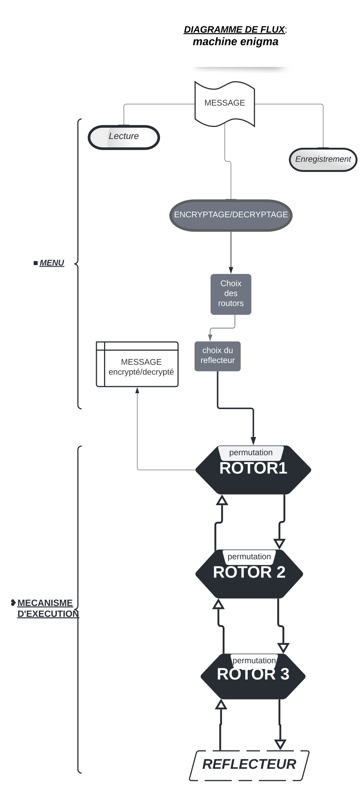

# egnigma
Simulation de la machine Enigma

# Objectifs

L'objectif du projet est de concevoir un programme qui simule la machine Enigma. 
Le projet sera codé avec la version `3` du langage de programmation <b>Python</b>.

Chaque message à transmettre sera reformater de sorte à enlever les <b>accents</b>, les <b>espaces</b>. Nous utilisons la librairie `unicodedata`.

Le fichier `rotor.init` contient ensemble des rotors et des réflecteurs, il est importé avec la méthode `load` contenu dans la librairie `json`. Cette méthode va faire la <b>dé-sérialisation</b> en dictionnaire de donné de l’objet contenu dans le fichier.

Le <b>décryptage /cryptage</b> se fait grâce au paramètres fournis par utilisateur

- Trois rotors (Ex : RA, RB, RC), 
- Une clé (Ex : k = 3)
- Un réflecteur (Ex : RFB)

# Stratégie de résolution - Méthodologie 

Afin de mener à bien notre projet il était nécessaire de commencé par nous poser des questions sur plusieurs plans.

Pourquoi le problème est survenu:
en effet il etait question de pouvoir établir des communications entre des personnes de manière sécurisé afin que des personnes non authorisés ne puissent avoir accès.

Méthodologie de résolution

évaluer l'urgence du problème fixé le délais 

* tout d'abord il fallait trouver les grands axes, 
nottament ressencé les différents élements dont nous aurons besoin et leur principe de fonctionnement
il s'agit ici des 
Rotors, 
les reflecteur, 
la clé, 
le message à coder ou décoder

* Par la suite, l'écriture de divers algorithmes et suivant les différentes méthodes trouvées, 
choisir celui qui compte moins de ligne et qui est le moins complexe.
et puis cas par cas écrire un algorithme.

* Par la suite nous realisons des différents tests afin d'évaluer le programme et vérifié
les différentes erreurs et appliquer les actions correctives

* En fin procéder à la traduction de l'algorithme en programme et réaliser le test final.


# Algorithmique

### Principes de cryptage d'un mot
<ul>
  <li>Je détermine la position de la lettre dans l'alphabet</li>
  <li>Je fait pivoter le premier rotor</li>
  <li>Je détermine la lettre correspondant a la position dans le premier rotor</li>
  <li>Je verifie si le premier rotor a déjà fait 26 tours
    <ol>
      Si oui
      <li>Je fait pivoter le second rotor</li>
      <li>Je remet le nombre de rotation du premier rotor a zéro</li>
    </ol>
  </li>
  <li>Je détermine la position de la nouvelle lettre  dans l'alphabet</li>
  <li>Je trouve la lettre correspondante à cette position dans le second rotor</li>
  <li>Je vérifie si le deuxième rotor a déjà fait 26 tours
    <ol>
      Si oui
      <li>Je fait pivoter le troisième rotor</li>
      <li>Je remet le nombre de rotation du second rotor à zéro</li>
    </ol>
  </li>
  <li>Je détermine la position de la second lettre dans l'alphabet</li>
  <li>Je trouve la lettre correspondante a la nouvelle position dans le troisième rotor</li>
  <li>Je détermine la position de la troisième lettre dans l'alphabet</li>
  <li>Je détermine la lettre correspondante a cette position dans le reflector</li>
  <li>J'inverse le réflecteur et je détermine la position de letter dans le reflecteur</li>
  <li>Je determine la position de cette nouvelle lettre dans l'alphabet</li>
  <li>Je determine la position de la nouvelle lettre dans le troisième rotor</li>
  <li>Je determine la lettre de position de la nouvelle lettre dans l'alphabet</li>
  <li>Je détermine la position de la nouvelle lettre dans le second roto</li>
  <li>Je determine la lettre de position de la nouvelle lettre dans l'alphabet</li>
  <li>Je détermine la position de la nouvelle lettre dans le premier rotor</li>
  <li>Je determine la lettre de cette position de  dans l'alphabet</li>
</ul>


### Algorithm pour determiner position

```
fonction :position_L(L:caracter,index:Caracter):entier
  var: i:entier
       posi:entier
  Debut 
    pour i allant de 1 a 26 faire
      si index[i]=L alors
          posi=i
      finsi 
    fin pour
   return posi
  fin fonction

```

### Algorithm pour pivoter rotor

```
Procedure: permute(Var Index:carac)
  var: permut:entier
 Debut
  permut=rotor_permut(List:chaine)
 Fin Procedure

```

### Algorithm pour correspondre 

```
Fonction: correspondre(index:carac,posi)
  var : i : entier
        L : carac
        index:carac
        W:caracter
  Debut
    i=position_L(L,index)
    Pour i allant de 1 a 26 faire 
      si position_L(L)=i
        W=index[i]
      fin si
    Fin Pour
    return(W)
  fin Fonction 
     
```

### Algorithm pour les revolution 

```
procedure : revolution (list:
  var: num_rot:entier
Debut 
  si num_rot=26
    permut=rotor_permut(List:chaine)
    num_rot=0
  fin si
  
```


# Diagramme de flux fonctionnel 



# Interface de programmation 

### Data

| Fonction      | Parametres | Descriptions     |
| :---        |    :----:   |          :--- |
| LECTURE DU MESSAGE <ul><li>lecture_message</li></ul>   | <ul><li>filename</li></ul>  <ul><li>result</li></ul>        | elle ouvre le fichier ou est contenue le message`filename`; appel la fonction `Generate` pour parcourir le message et retiré les accents sur les caractére accentués et met le resultat obtenue dans une liste `result`     |
| SAUVEGARDE DU MESSAGE <ul><li>save_message</li></ul>   | <ul><li>filename</li></ul>  <ul><li>message_in</li></ul>       | le fichier contenant le message`filename` ouvert, il le sauvergarde en ecrivant le fichier dans `message_in`     |
| TELECHARGEMENT DES PARAMETRES <ul><li>load_params</li></ul>   | <ul><li>settings_file: `str`</li></ul>       | Upload des valeurs des rotors et réflectors contenu dans le `settings_file` La bibliothèque `json` pour lire dans le fichier settings_file    |
| SELECTION DE ROTOR ET REFLECTEUR <ul><li>select_main_rotor_and_reflector</li></ul>   |<ul><li>selected_rotor : `[]`</li> <li>selected_reflector: `string`</li></ul>| Permet de  <ul><li>Faire le choix de 03 rotors parmis les 05 presents</li><li>Faire le choix d'un reflecteur parmis les 02 presents</li></ul>     |
|PERMUTATION DES ROTORS <ul><li>rotor_permute</li></ul>   |<ul><li>rotor_name : la nom du rotor</li> <li>key: la clé de cryptage par défaut vaut 1</li></ul>| permet de permuter un rotor d'une position <ul><li>On insere le dernier élément de la liste au début du tableau `insert(0, value[-1])`</li><li>On retire le dernier élement de la liste `pop(-1)`</li></ul>   |
|REFLECTEUR  <ul><li>get_letter_reflector(index)</li> <li>get_inverse_reflector_position(letter)</li></ul>    |<ul><li>letter</li> <li>index</li></ul> | Le réflecteur renvoie image d'une lettre, pour se faire on détermine <ul> <li>a lettre grace a sa positon `get_letter_reflector`</li> <li>on inverse le reflecteur et on renvoie la nouvelle position de la lettre dans le reflecteur `get_inverse_reflector_position` </li><li>cette position est utiliser pour le chemin inverse de algoritme</li></ul>  |
  |TROUVER LES LETTRES <ul><li>get_letter</li></ul> | <ul><li>rotor_key</li></ul> <ul><li>index</li></ul>   |retourne la lettre contenue a une position `X` du rotor|
|TROUVER LA POSITION <ul><li>get_index</li></ul>  | <ul><li>rotor_key</li></ul> <ul><li>letter</li></ul>   |retourne la position `X` d'une lettre dans un rotor|
|VERIFIE NOMBRE DE TOURS <ul><li>check_total_rotation</li></ul> |<ul><li>rotor_key</li></ul>   |verifie si le rotor a fait `26 tours` si oui renvoie `True` sinon `False`|
|REMISE A ZERO <ul><li>reset_rotation</li></ul> | <ul><li>rotor_key</li></ul>  |remet le nombre de tours d'un rotor a `zero`|

### Application

| Fonctionnalité | Fonction    | Parameètre  | Description   |
| :--- | :---        |    :----:   |          :--- |
|Lecture du message | begin_lecture_message      | Aucun       | Li le message contenu dans un fichier, si le fichier est introuvable le programme affiche fichier indisponible  |
|Sauvegarde le message | begin_save_message   | Aucun        | Sauvegarde le message à crypter, utilisateur sasie le message et le nom du fichier dans le quel le message sera sauvegarder      |
|Encryptage et Décriptage | begin_encrypt      | Aucun       | Début du cryptage,  chargement des `données`, l'utilisateur sélectionne les rotors et le réflecteur, saisie le message et le fichier de sauvegarde du méssage  |
|Quitter le programme| exit      | Aucun       | Quitte le programme  |

### LOGIQUE
| Fonction    | Parametres  | Descriptions  |
| :---        |    :----:   |          :--- |
| INITIATEUR DE CRYPTAGE <ul><li>Begin_encrypt</li></ul> |     /   | Fonction mère contenant toutes les autres fonctions ci-dessous. `Permet le démarrage du cryptage` en faisant appel aux fonctions ci-dessous|
|Sélections des rotors <ul><li>Selected_rotor</li></ul>   | `Tableau`   |Demande a l’utilisateur de choisir 03 rotors et vérifie si sont choix est dans la liste ; après le choix d’un rotor il le retire de la liste pour que l’utilisateur n’est pas des rotors semblable dans son tableau|
|Ordre des rotors <ul><li>trie</li></ul> | /  | S’assure que l’ordre des choix des rotors soit égal à l’ordre de leur position ensuite le met dans la liste |
|Sélection du réflecteur <ul><li>Reflector_choice</li></ul> | `dictionnaire`  | Parcours la liste des réflecteurs et demande a l’utilisateur d’entrer la chaine caractère correspondant au réflecteur choisie et met dans un dictionnaire le réflecteur choisie  |
|Sauvegarde du message <ul><li>Data.save_message</li></ul>  | <ul><li>F ‘‘`{file_name }.txt`", message</li></ul>  <ul><li>Out = `[]`</li></ul>  |Sauvegarde le message `d’entrer/de sortie` dans un fichier |
|Sélections de rotors et réflecteur<ul><li>Data.select_main_rotor_and_reflector</li></ul> | <ul><li>Selected_rotor  <ul><li>Reflector_choice |Permet de faire appel au rotor et réflecteur sélectionné dans la fonction Begin_encrypt|
|Lecture du message <ul><li>Data.lecture_message</li></ul> | <ul><li>F ‘‘`{file_name}.Txt`</li></ul>  <ul><li>out</li></ul> |Prends le message contenue dans le fichier et l’écrit dans la partie réservé au message a encrypté/décrypté|
|Machine d’encryptage CESAR <ul><li>Enigma_machine</li></ul> | <ul><li>Out [0]</li></ul> <ul><li>en</li></ul> |Fonction codage et décodage d’un message selon le positionnement des rotors et du réflecteur|


# Tests
Dans cette rubrique, nous verons si notre programme fonctionne correctement.

Tout d'abord le test est l'une des parties des plus importante du developpement car c'est ici que nous verons si le programme répond au besoin.
Comme tout projet le besoin ou but ici est de realiser le codage et le décryptage d'un message en utilisant l'algorithme egnigma.

Pour réaliser notre test, nous allons coder le message "Bonjour".

Afin de pouvoir realiser ce projet nous avons conçu une interface user, permettant à l'utilisateur d'interagir avec la machine.
l'interface conçue est constitué d'un "Menu de selection" qui renseigne l'utilisateur sur la procédure à entreprendre afin de réaliser au mieux soit le codage, soit le décryptage du message.

***Codage du message***

- une fois le programme lancé, il apparaît un menu de selection ci-dessous:
```
Menu de sélection

1 - Lecture Message                 en prenant le choix=1 on realise la lecture du message

2 - Enregistre Message              le choix=2 permet à l'utilisateur de realiser l'enregistrement du message

3 - Cryptage/Decryptage             le choix=3 ici demande à l'utilisateur s'il souhaite faire le cryptage ou le décryptage

4 - Quitter                         le choix=4 provoque l'arrêt du programme
```

- une fois le programme lancé la rubrique "menu de sélection" s'affiche et là nous avons la possibilité de faire un choix sur l'action que nous désirons entreprendre. 
Ici en faisant le choix=2 nous effectuons l'enregistrement du Message
```
Menu de sélection

1 - Lecture Message

2 - Enregistre Message

3 - Cryptage/Decryptage

4 - Quitter

choix = 2

Message = bonjour
```

- Une fois le message écrit, le programme demande d'entrer le fichier de sauvegarde et le message est enregistré automatiquement dans le fichier.
```
Fichier de sauvegarde = bonjour.txt

Le message bonjour a été sauvegarder dans le fichier bonjour.txt.txt
```

- Le message ecrit et sauvegardé dans le fichier, de nouveau le menu de sélection apparait et ici on procède à la lecture du fichier
```
Menu de sélection

1 - Lecture Message

2 - Enregistre Message

3 - Cryptage/Decryptage

4 - Quitter

choix = 1

File Name : bonjour.txt

['BONJOUR']
```

- Lorsque le fichier a été lu, de nouveau le menu de sélection apparait et là il faut choisir entre cryptage et décryptoage en entrant le choix= 3 ainsi le programme realise soit le cryptage ou le décryptage
```
Menu de sélection

1 - Lecture Message

2 - Enregistre Message

3 - Cryptage/Decryptage

4 - Quitter

choix = 3
```

- Ce qui suit est le choix des rotors et par défaut il faut choisir 3 parmis les 5 rotors. la fonction permute realisera la rotation des différents rotors en fonction de la clés.
```
1 - RA

2 - RB

3 - RC

4 - RD

5 - RE

Les rotors choisis ici sont:

Rotors : ['RA', 'RB', 'RC']
```

- Après avoir réalisé le choix des rotors nous devons éffectuer le choix du reflecteur et c'est ici que sera etablit une correspondante entre le message écrit et le cryptage et puis renvérra le message crypté
```
1 - RFA

2 - RFB

le Reflector choisit est
Reflector = RFB

Message = bonjour

Fichier = bonjour.txt

message = BONJOUR

message codé : UFBNFRA

Process finished with exit code 0
``` 
***Décryptage***

Pour ce qui est du décryptage, c'est la partie où sera déchiffré le sens du texte codé, le traduire en claire pour en déceler son sens caché au fond.
Le besoin ici est celui d'acceder à l'information cryptée. La procédure est la même que celle du cryptage , à la différence que l'utilisateur devra 
tout d'abord lire le message crypté ensuite enclencher l'option de décryptage.

Réalisons le test de décryptage
```
Menu de sélection

1 - Lecture Message                 en prenant le choix=1 on realise la lecture du message

2 - Enregistre Message              le choix=2 permet à l'utilisateur de realiser l'enregistrement du message

3 - Cryptage/Decryptage             le choix=3 ici demande à l'utilisateur s'il souhaite faire le cryptage ou le décryptage

4 - Quitter                         le choix=4 provoque l'arrêt du programme
```

- le programme lancé, on réalise tout d'abord la lecture du message 
```
Menu de sélection

1 - Lecture Message

2 - Enregistre Message

3 - Cryptage/Decryptage

4 - Quitter

choix = 1

File Name : bonjour.txt

['UFBNFRA']
```
- Dès lors que le programme a lu le message, la prochaine étape est de faire le décryptage en rentrant le choix=3
- On réalise le choix des rotors et par défaut il faut choisir 3 parmis les 5 rotors et ceci doit-être suivant les ceux utilisé lors du cryptage
```
1 - RA

2 - RB

3 - RC

4 - RD

5 - RE

Les rotors choisis ici sont:

Rotors : ['RA', 'RB', 'RC']
```
- Il ne reste plus qu'a faire le choix du reflecteur et la correspondance entre le message crypté et l'information recherché est etablit et le message réapparaît en clair
```
1 - RFA

2 - RFB

le Reflector choisit est
Reflector = RFB

Message = UFBNFRA

Fichier = bonjour.txt

message = UFBNFRA

message codé : BONJOUR

Process finished with exit code 0
``` 
***conclusion***
- Au vue de ce tout ce qui précède il apparaît que le message "BONJOUR" qui a été codé en "UFBNFRA" ce qui nous permet de dire que la procédure de cryptage marche parfaitement.
- Une tentative de décryptage du code "UFBNFRA" renvoi en message codé: BONJOUR qui correspond au message crypté au depart.

Il ne faudrait pas oublié que pour que ceci soit rendu possible il faudrait que le choix de rotors utilisé lors du Cryptage soit le même que celui utilisé lors du décryptage 
ainsi celui si sera possible.
On peut donc conclure que le programme fonctionne parfaitement.
# Questions 

# Conclusion 
Enigma est une machine de cryptage CESAR creer vers la seconde Guerre mondiale elle consiste a entrer un message a l'aide d'un clavier et d'obtenir en sortie se message crypté.en effet lors de notre travail il nous a été difficile de s'entendre sur une idée definitive vue qu'on était tous en distanciel alors l'on a due se retrouvé une ou deux fois en presentiel ou l'on a sortie un plan detaillé du projet un chef de groupe et partagé les pages a faire sur le code et aprés cela,il nous a été facile de resoudre le projet.
Aprés avoir fini le code l'on c'est rendue compte qu'il ne nous était pas utile de faire une autre fonction de décryptage mais que la meme fonction nous permettra de decrypté;mais nous avons rencontrer des problemes au niveau de décryptage lorsque l'on introduit le message crypté en sortie dans le programme l'on n'obtient pas comme le resultat le message de depart; nous avons essayer de nous documenter sur le web et de revoir notre code au niveau des rotors et reflecteurs.
ce programme a été un grand challenge pour nous;mais elle nous a appris a maitriser diverse methode attachés au liste tableau fonction etc... 

# Bibliographie

Machine d'énigme de papier. (24 févr. 2017). Youtube Consulté le 2022, à l’adresse https://www.youtube.com/watch?v=UKbP3Rjxhy0

Python 3 : des fondamentaux aux concepts avancés du langage. (s. d.). Python 3 : des fondamentaux aux concepts avancés du langage. Consulté le 2022, à l’adresse https://lms.fun-mooc.fr/courses/course-v1:UCA+107001+session02/info
