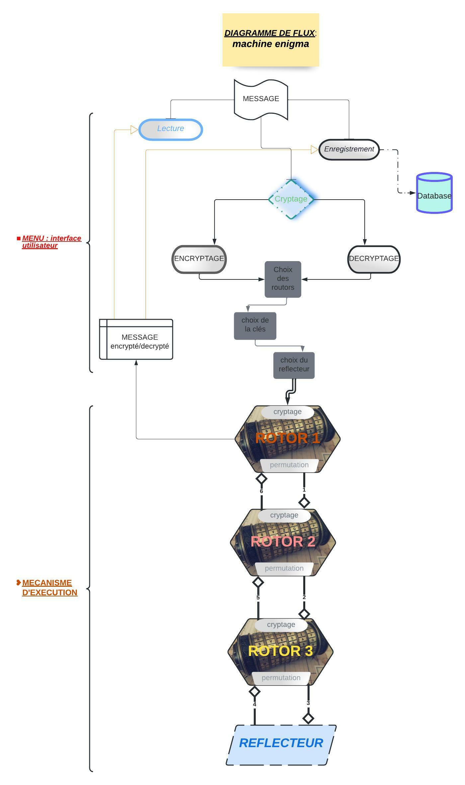

# egnigma
Simulation de la machine Enigma

# Objectifs

L'objectif du projet est de concevoir un programme qui simule la machine Enigma. 
Le projet sera codé avec la version `3` du langage de programmation <b>Python</b>.

Chaque message à transmettre sera reformater de sorte à enlever les <b>accents</b>, les <b>espaces</b>. Nous utilisons la librairie `unicodedata`.

Le fichier `rotor.init` contient ensemble des rotors et des réflecteurs, il est importé avec la méthode `load` contenu dans la librairie `json`. Cette méthode va faire la <b>dé-sérialisation</b> en dictionnaire de donné de l’objet contenu dans le fichier.

Le <b>décryptage /cryptage</b> se fait grâce au paramètres fournis par utilisateur

- Trois rotors (Ex : RA, RB, RC), 
- Une clé (Ex : k = 3)
- Un réflecteur (Ex : RFB)

Avec ses exemple de paramètres la première saisie de la lettre <b>A</b> sera crypté/décrypté en <b>J</b>

# Stratégie de résolution - Méthodologie 

# Algorithmique

# Diagramme de flux fonctionnel 

# Interface de programmation 

### Data

| Fonction    | Parametres  | Descriptions  |
| :---        |    :----:   |          :--- |
| GENERATEUR(generate)    |     it (iterateur)      | cette fonction permet de verifier les caractére du message entré et donc si un caractere est accentué il retire sont accent|
| LECTURE DU MESSAGE(lecture_message)   | filename et result      | elle ouvre le fichier ou est contenue le message(filename); appel la fonction GENERATE pour parcourir le message et retiré les accents sur les caractére accentués et met le resultat obtenue dans une liste (result)     |
|SAUVEGARDE DU MESSAGE(save_message)   |filename et message_in    |le fichier contenant le message(filename) ouvert, il le sauvergarde en ecrivant le fichier dans message_in|
|TELECHARGEMENT DES PARAMETRE (load_params) | settings_file  | permet d'ouvrir la bibliothéque json ou sont contenue les differents rotors(05) et reflecteurs(02) .puis fait appel a la fonction d'initiation des rotors et reflecteurs(init_rotor_and_reflector) pour telecharger la bibliotheque json dans le fichier settings_file|
|INITIATEUR DE ROTOR ET REFLECTEUR (init_rotor_and_reflector) | rotors et reflecteurs  | elle permet d'ouvrir le fichier contenant les rotors et reflecteurs puis convertit chaque element du fichier(unicode) en chaine de caractere  |
| SELECTION DE ROTOR ET REFLECTEUR (select_main_rotor_and_reflector) | selected_rotor et selected_reflector  | permet de faire le choix de 03 rotors parmis les 05 presents et aussi le choix d'un reflecteur parmis les 02 presents et sa utilise l'ordre du choix respectivement sur l'ordre des rotors  |
|PERMUTATION DES ROTORS (rotor_permute) | rotor_name et key | permet de permuter chaque rotor aprés qu'un caractére y soit passé en prenant un nombre de carctére(nombre etant egale a la clés)au debut de la chaine puis le renvoie en fin de chaine  |
|FONCTION DU REFLECTEUR (make_reflector)  | character et key  | lorque le charactére arrive au niveau du reflecteur elle se repere dans le reflecteur puis prends son indice et l'additionne a la clés pour trouvé la nouvelle correspondances en sortie du caractére en entrée  |

### Présentation

| Fonctionnalité | Fonction    | Parameètre  | Description   |
| :--- | :---        |    :----:   |          :--- |
|Lecture du message | begin_lecture_message      | Aucun       | Li le message contenu dans un fichier, si le fichier est introuvable le programme affiche fichier indisponible  |
|Sauvegarde le message | begin_save_message   | Aucun        | Sauvegarde le message à crypter, utilisateur sasie le message et le nom du fichier dans le quel le message sera sauvegarder      |
|Encryptage et Décriptage | begin_encrypt      | Aucun       | Début du cryptage,  chargement des `données`, l'utilisateur sélectionne les rotors et le réflecteur, saisie le message et le fichier de sauvegarde du méssage  |
|Quitter le programme| exit      | Aucun       | Quitte le programme  |

### LOGIQUE

# Tests

# Questions 

# Conclusion 

# Bibliographie

